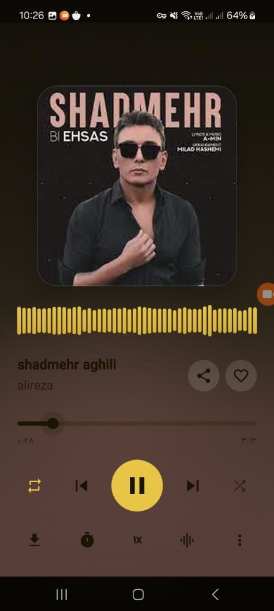
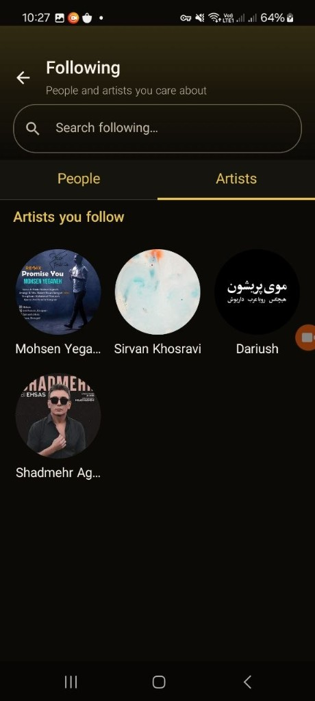

# MeloNet

Android music platform with a dedicated backend: online playback, personal library, real-time chat, karaoke, and AI voice covers.

<p align="center">
  
  &nbsp;&nbsp;
  
</p>

<p align="center">
  <b>Full player</b> with visualizer and advanced controls &nbsp;·&nbsp; <b>Following</b> for artists and people
</p>

---

## Demo

Short walkthrough of the app in use:

<video src="docs/media/demo.mp4" controls width="360" poster="docs/media/player.png">
  Your browser does not support the video tag —
  <a href="docs/media/demo.mp4">download / watch demo.mp4</a>
</video>

If the video preview does not render on GitHub, open the file directly:

[`docs/media/demo.mp4`](docs/media/demo.mp4)

---

## Features

### Playback & listening
- **Full-screen player** with album art, palette-driven gradients, and an **audio visualizer**
- Full controls: play/pause, previous/next, shuffle, repeat, seek
- **Mini player** in the app shell with a smooth expand transition (shared element)
- Playback speed (e.g. `1x`), **sleep timer**, and **equalizer**
- Downloads for offline listening (Premium)
- MediaSession / system notification integration

### Catalog & discovery
- Home feed with recommendations and trending content
- Search across songs and artists
- Artist and song detail screens
- Categorized catalog browsing

### Personal library
- Liked songs and recently played
- User playlists (create, detail, add songs)
- **Local music** from device storage
- Download management

### Social
- **Following** — people and artists, with separate tabs and in-list search
- User profile / edit profile
- Song sharing (in chat or externally)

### Real-time chat
- Conversation list and one-to-one chat
- Messages and in-chat song sharing
- **WebSocket** connection for live messages and online/offline status

### Karaoke
- Pick a song and record with the microphone
- Manage takes and play recordings back

### Voice Cover (AI)
- Choose a song and an artist voice model
- Backend job queue (Demucs → RVC → mix)
- Play finished covers inside the app

### Account & settings
- Sign up / sign in with JWT
- App settings, RTL support, Persian & English strings
- Premium mode for offline downloads

---

## Repository layout

```text
MeloNet/
├── melonet-android/     # Android app (Kotlin + Jetpack Compose)
├── melonet-backend/     # API (Go) + Voice Worker (Python)
└── docs/media/          # Screenshots and demo for this README
```

| Part | Role |
|------|------|
| **melonet-android** | Mobile client, UI, playback, local cache |
| **melonet-backend** | REST API, chat WebSocket, streaming, storage |
| **voice-worker** | Voice Cover jobs on Redis |

---

## Tech stack

### Android (`melonet-android`)

| Area | Technology |
|------|------------|
| Language | **Kotlin 2.2** |
| UI | **Jetpack Compose** + **Material 3** |
| Architecture | MVI-style (Contract / ViewModel / Effect), Navigation Compose |
| DI | **Koin** |
| Networking | **Retrofit**, **OkHttp**, Gson |
| Concurrency | **Kotlin Coroutines** + Flow |
| Playback | **Media3 (ExoPlayer)** + MediaSession |
| Local database | **Room** |
| Large lists | **Paging 3** |
| Preferences | **DataStore** |
| Images | **Coil** + **Palette** (player gradients) |
| Background work | **WorkManager** (downloads) |
| Route serialization | **Kotlinx Serialization** |
| Testing | JUnit, MockK, Turbine, Espresso |

### Backend API (`melonet-backend`)

| Area | Technology |
|------|------------|
| Language | **Go 1.22+** |
| HTTP | **Gin** |
| Database | **PostgreSQL 16** + golang-migrate |
| Cache / queues / presence | **Redis** |
| File storage | **MinIO** (S3-compatible) |
| Auth | **JWT** (golang-jwt) |
| Chat | **Gorilla WebSocket** |
| DB driver | **pgx** |
| Audio catalog | Stream proxy (including Audius-backed paths) |
| Orchestration | **Docker Compose** |

### Voice Cover Worker

| Area | Technology |
|------|------------|
| Language | **Python** |
| Queue | Redis list (`voice_cover:jobs`) |
| Source separation | **Demucs** |
| Voice conversion | **RVC** (`rvc-python`) |
| Result upload | MinIO |
| Job status | PostgreSQL |

### Tooling & infrastructure

- Android Gradle Plugin 8.13, KSP  
- Flavors: `dev` / `staging` / `prod`  
- Makefile for `docker-up`, seed, and API URL sync on LAN/USB  
- LRCLIB for synced lyrics on the client  

---

## Quick start

### 1) Backend

```bash
cd melonet-backend
make docker-up      # Postgres + Redis + MinIO + API (+ voice-worker)
make docker-seed    # optional: sample data
```

API listens on `http://localhost:8080`.

More detail: [`melonet-backend/README.md`](melonet-backend/README.md)

### 2) Android

```bash
cd melonet-android
# Set the API base URL in local.properties, for example:
# melonet.devApiBaseUrl=http://127.0.0.1:8080/
```

In Android Studio, build the **`devDebug`** variant (or `devRelease` with `adb reverse`) and install on a device/emulator.

For a physical phone over USB:

```bash
adb reverse tcp:8080 tcp:8080
```

> The `dev` flavor talks to a local backend — the API must be running on your machine for real end-to-end testing.

---

## Screenshots

| Player | Following |
|--------|-----------|
|  |  |

- **Player:** cover art, visualizer, like/share, seek, shuffle/repeat, download, sleep timer, speed, equalizer  
- **Following:** search, People / Artists tabs, followed-artist grid  

---

## Project status

This repository includes a full Android client and backend for local development and demos. Separate `staging` / `prod` deployments can be selected via the app product flavors when those environments are available.

---

## License

Add a license file at the repository root if you want to publish one.
